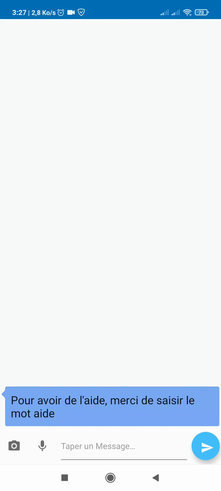
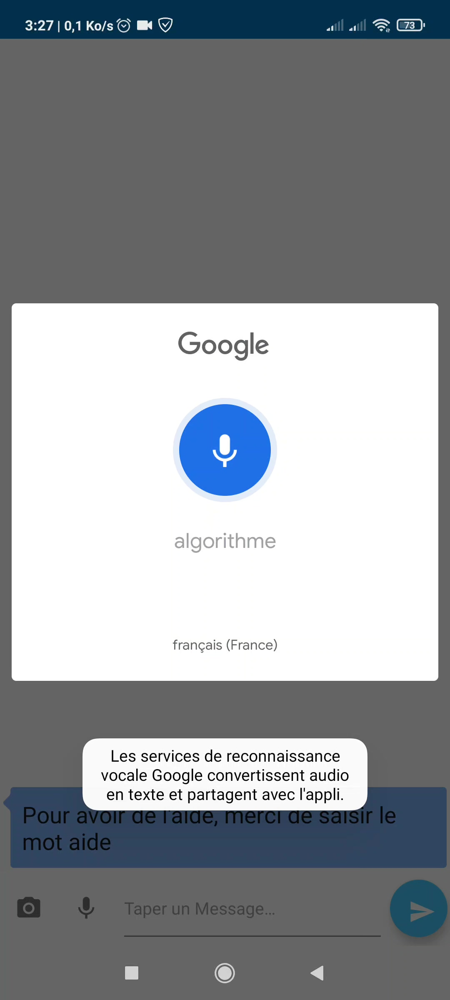
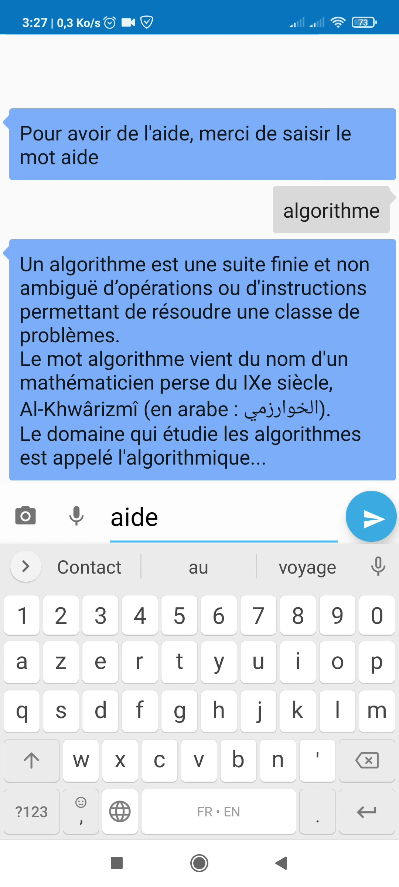
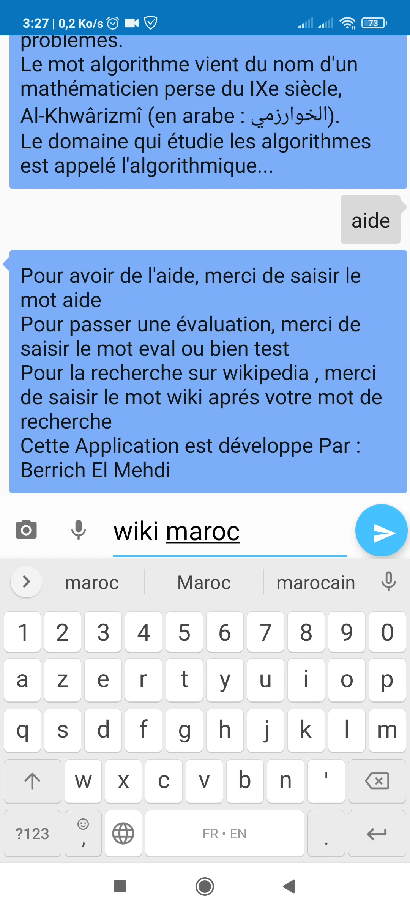
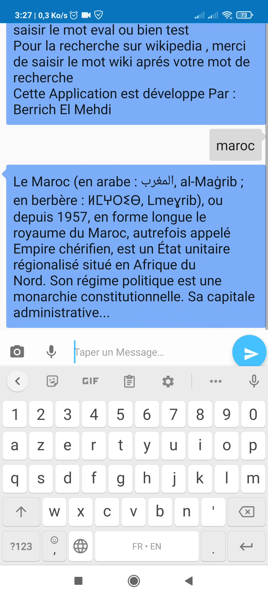
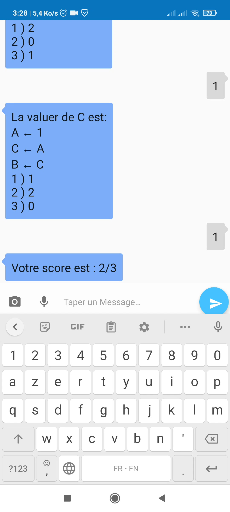

# AlgoBot - An Android ChatBot by Berrich El Mehdi

[](https://github.com/elmehdi-23/AlgoBot)

AlgoBot is ChatBot running on Android
<p align="center"></p>

<h2>Coding the app on Android Studio</h2>
Android Studio is the Official IDE for Android. Android Studio provides the fastest tools for building apps on every type of Android device.

Clone the [repo](https://github.com/elmehdi-23/AlgoBot) and import the code in Android Studio,

```
git clone https://github.com/elmehdi-23/AlgoBot.git
```
## Functions
<p align="center"></p>

### Speech to Text
<p align="center"></p>

### Text to Speech
<p align="center"></p>

### Wikipedia API
<p align="center" style="display:inline-block;"></p>

### OCR Optical character recognitition

### Evaluation Mode
<p align="center"></p>
